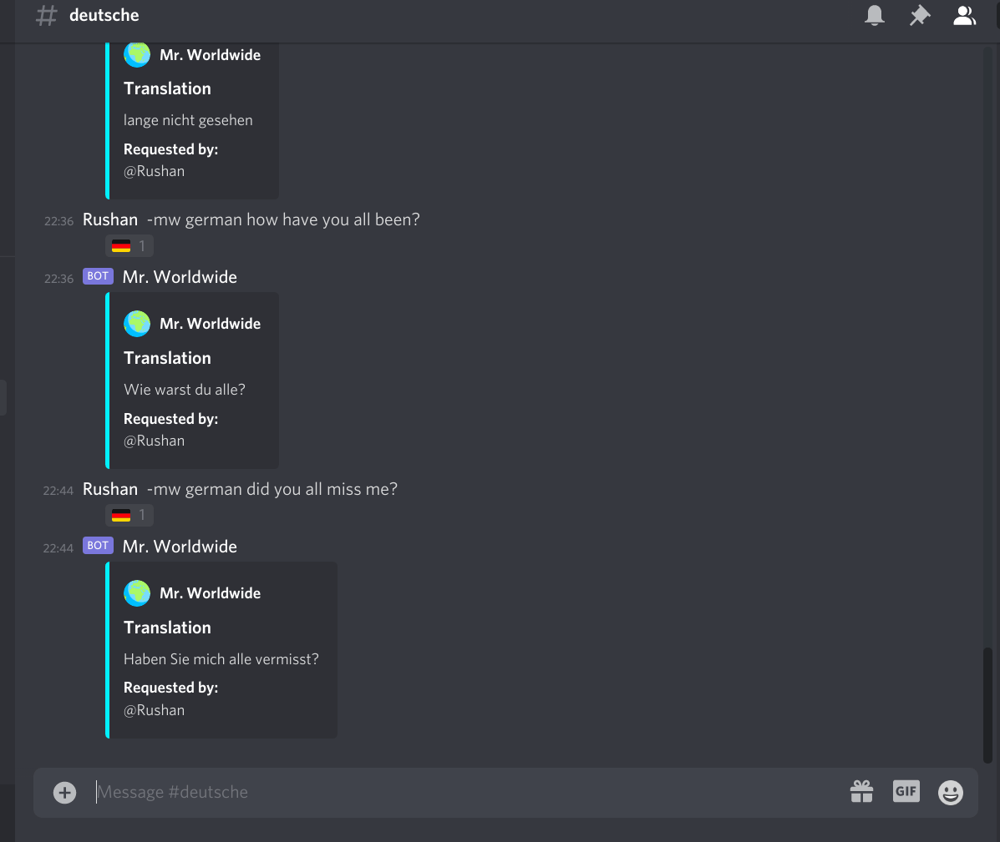

<p align="center">

</p>
<h1 align = "center"> Mr-Worldwide </h1>

<p align="center">
   
 
   
   
  
 </p>

<p align="center">🌍 The best free discord translation bot. Translate between languages on your discord server, quickly.</p>

<br>
<br>


## Overview
<p align="center">
  
Do you have a **multicultural** discord sever? Or do you have **language study groups** on discord like me? Or even if you just want to find out quickly what your russian comrades on csgo mean, **Mr. Worldwide** is perfect for all your language translation needs and is here to make your life a little easier.

</p>

<br>
<br>

<p align="center">

</p>

<br>

## How to use

To translate a sentence on your server simply type:<br> <br>
**```-mw lang_name the sentence to be translated```**

<br>
<br>


> :warning: **You can also use the ISO-639-1 code of the language instead of the language name for increased efficiency.**

<br>
<br>

## Commands

|    Command     |    Description    |
| ------------- | ------------- |
| -mw  | Shows the help embed.  |
| -mw help  | Shows the help embed. |
| -mw lang_name sentence| Automatically detects the sentence language and translates it into the specified language.|
| -mw ping | Pings the bot and shows it's latency.|

<br>
<br>

## Installation

<br>

The installation is simple :), you **do NOT need to know** how to code to get the bot up and running. Just follow these steps:

<br>

🔴 1. Invite the bot to your server by clicking [here.](https://discord.com/api/oauth2/authorize?client_id=781185611548983326&permissions=523328&scope=bot)🔴

2. Make sure you have [Node.js](https://nodejs.org/en/download/package-manager/) and npm installed.
3. Clone the repository and then navigate to it in your terminal.
4. Enter ```npm install``` to install the dependencies.
5. Enter ```node bot.js``` to run the bot. The bot should be online on your server in a few seconds.
6. Enjoy!

<br>
<br>

## License

MIT License <br>
Copyright ©  2020 Rushan Khan

<br>
<br>

> <div>Icon made by <a href="https://www.flaticon.com/authors/freepik" title="Freepik">Freepik</a> from <a href="https://www.flaticon.com/" title="Flaticon">www.flaticon.com</a></div>